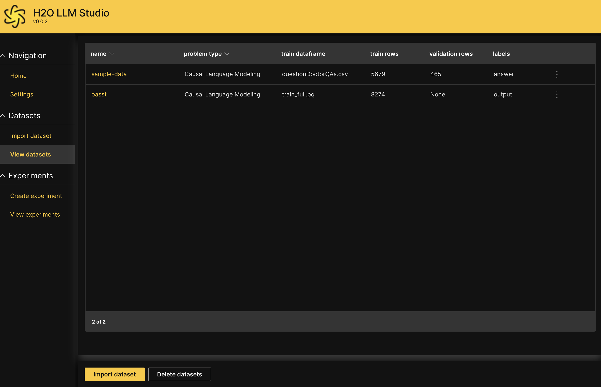

import Icon from "@material-ui/core/Icon";

# View and manage dataset

You can view, review, edit, or delete your datasets once you have imported them. You can also start a new experiment using a dataset you have imported. 

## View a dataset

To view an imported dataset:

1. On the H2O LLM Studio left-navigation pane, click **View datasets**.

2. You will see the datasets table with a list of all the datasets you have imported so far. Click the name of the dataset that you want to view.

    

    :::info
    For more information about the dataset details you see on the table above, see [dataset configurations](import-dataset.md#configure-a-dataset).
    :::

## Dataset tabs

You will see the following tabs that provide details and different aspects of your dataset.

- **Sample train data** : This tab contains sample training data from the imported dataset.

- **Sample train visualization:** This tab visualizes a few sample training data from the imported dataset in a question-answer format; simulating the way the chatbot would answer questions based on the training data. 

- **Train data statistics:** This tab contains metrics about the training data (e.g., unique values) from the imported dataset.

- **Summary:** This tab contains the following details about the dataset. 

    | Name      | Description                          |
    | ----------- | ------------------------------------ |
    | **Name**        | Name of the dataset.  |
    | **Problem type**        | Problem type of the dataset. |
    | **Train dataframe**   | Name of the training dataframe in the imported dataset. An imported dataset can contain train, test, and validation dataframes.  |
    | **Train rows**       | The number of rows the train dataframe contains.  |
    | **Validation dataframe**       | Name of the validation dataframe in the imported dataset. An imported dataset can contain train, test, and validation dataframes.  |
    | **Validation rows**         | The number of rows the validation dataframe contains. |
    | **Labels**       | The labels the imported dataset contains.  |

## Edit a dataset

To edit an imported dataset,

1. On the H2O LLM Studio left-navigation pane, click **View datasets**. You will see the datasets table with a list of all the datasets you have imported so far.
2. Locate the row of the dataset you want to edit and click the <Icon>more_vert</Icon> Kebab menu.
3. Select **Edit dataset**.
4. Make the desired changes to the dataset configuration. You can also [merge the dataset with an existing dataset](merge-datasets) at this point.
5. Click **Continue** and review the dataset with your changes. 

<!-- 
## Start a new experiment

link to start a new experiment page in the experiments sub page.  -->

## Delete a dataset

When a dataset is no longer needed, you can delete it. Deleted datasets are permanently removed from the H2O LLM Studio instance.

:::caution
You can only delete datasets that are not linked to any experiments. If you wish to delete a dataset that is linked to an experiment, first [delete the experiment](../experiments/view-an-experiment#delete-an-experiment), and then delete the dataset. 
:::

1. On the H2O LLM Studio left-navigation pane, click **View datasets**.
2. Click **Delete datasets**.
3. Select the dataset(s) that you want to delete.
4. Click **Delete** to confirm deletion.